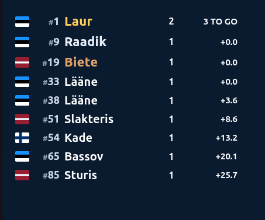

# Mis on COZERis uut

*In English / inglise keeles: [whats-new.md](whats-new.md).*

> **Tõlkija märkus (ülevaatuseks).** See on ingliskeelse teksti tõlke mustand. Rakenduse ja
> GitHubi nupunimed on jäetud inglise keelde (**paksus kirjas**), sulgudes eestikeelne selgitus.
> Palun täpsusta sõnastust vajadusel.

See lehekülg selgitab lihtsas keeles, arvutioskust vajamata, mis on COZERis muutunud ja paremaks
läinud. Kõige uuemad märkmed on ülal. Kui tuled vanalt COZERilt, annab lõpus olev **"Vanalt
COZERilt üleminek"** ülevaate suurest pildist.

> **Märkus.** COZER 3 on praegu **väljalaskekandidaat** (release candidate) — seda katsetatakse
> enne lõplikku versiooni. Kui märkad midagi valesti, saada palun veateade (nupp **Report a bug…**
> paremas ülanurgas) — see aitab palju.

---

<!-- Iga uue versiooni ilmumisel lisa siia lühike "## COZER X.Y (kuu aasta)" jaotis,
     uusim üleval, enne "Vanalt COZERilt üleminek" ülevaadet. -->

## Enam ei "hangu", karistuste märkused tulemustel ja täielik ülevaatuse vorm (juuli 2026)

<!-- release-notes:3.0.0rc9 -->

- **COZER ei näi enam "hangununa".** Kui COZER midagi küsib (salvestamise küsimus, kinnitus), tuleb
  dialoog nüüd alati **ette ja vilgub tegumiribal**, nii et see ei saa vastust oodates peituda teise akna
  taha — brauseri, otseülekande lehe või teise ekraani akna taha. Puhtinformatiivsed teated
  ("no data warnings", "up to date") ei sega enam üldse — need ilmuvad olekuribale. Parandatud ka krahh
  **Phases** akna avamisel.
- **Kirjuta karistuse põhjus ja see trükitakse tulemustele.** **Edit Records**'is saab nüüd lisada
  karistus-/reeglimärgile lühikese **märkuse** (miks see anti); see kogutakse tulemuste väljatrüki
  **Notes** (märkused) jaotisse. Reegli lisamise menüü näitab ka iga reegli kõrval **U.I.M. artiklit**.
- **Täielik stardieelse ülevaatuse vorm.** **Inspection (Cockpit)** väljatrükk sisaldab nüüd
  **täielikku U.I.M. 2026 kontroll-loendit** tugevdatud kabiiniga klassile (F2 / F4 / F 500) **ühel
  lehel** — iga punkt on kohustuslik, kui pole märgitud teisiti, ja sertifikaadiga tõendatavad punktid on
  eraldi "documents" plokis, mitte ei kontrollita neid rambil uuesti.
- **Tulemused: vali kiirus või aeg, selgemad ringiarvud.** Uus valik **Result: speed / total time**
  Reports-sakil; ja läbitud ringide arv näidatakse nüüd **ainult paadil, kes ei lõpetanud täisdistantsi**
  (allmärkus selgitab, et ringiarvu puudumine tähendab kõigi ringide läbimist).
- **Korrastatud otseülekanne.** Ülekande seadistus on nüüd oma **Broadcast** menüüs, vaikimisi
  **live.cozer.ee**, ja pakub **kanalivalijat**, et vaataja saaks valida ajavõtjate voogude vahel.
- **Väiksemad parandused.** Rippmenüüd on taas loetavad (esiletõstetud rida oli mõnel süsteemil
  nähtamatu); faasisakkide all näidatakse sõidu number tavalise numbrina; ja Edit Recordsi Class/Heat
  valija ei näita enam `/T`/`/Q` lõppu.

## Ajasõidud, ülevaatuse vormid ja otseülekanne telefonis (juuli 2026)

<!-- release-notes:3.0.0rc8 -->

- **Ajasõit saab õiglase tulemuse ja oma väljatrükivormi.** Aega **Start'ist esimese ringijooneni**
  enam arvesse ei võeta — see on stardieelne lõik, mitte ring — nii et kiireim stardist ei saa enam
  ebaausalt lühikest "parimat ringi". Uus **Treening / ajasõit** väljatrükk järjestab paadid nende
  **parima täisringi** järgi, ilma punktide ja sõiduveergudeta (COZERi jaoks on treening ja soolo-ajasõit
  sama asi).
- **Korrastatud raportite sakk.** Kaasatavad klassid on nüüd jaotatud **faasi-kaartidele** — Ajasõidud /
  Kvalifikatsioonid / Ring — ja iga klass on näha lihtsa nimega, ilma `/T` või `/Q` lõputa, mis inimesi
  segas. (See parandas ka krahhi ajasõidu raporti tegemisel.)
- **Võistluseelse ülevaatuse vormid.** Kaks uut väljatrükki — **Inspection (Cockpit)** ja **Inspection
  (Non-cockpit)** — U.I.M. 2026 võistluseelsed ülevaatuse kontroll-lehed, iga paadi kohta oma leht, kus
  klass, number ja sõitja on ette täidetud.
- **Otseülekanne telefonis.** Ülekande lehekülg mahutab end nüüd kenasti **nutitelefoni**, nii et
  jooksvat järjestust saab jälgida ka liikvel olles. (Videovoo jaoks mõeldud kroma-võti jääb samaks.)

## Ajavõtuvigade püüdmine ja puhtam otseülekanne (juuli 2026)

<!-- release-notes:3.0.0rc7 -->

- **Otseülekanne ei näita enam finiši järel "kõik 0.0".** Kui paati vajutati veel korra kohe pärast
  finišijoone ületamist, võis edetabel kokku kukkuda nii, et iga vahe näitas **+0.0**. See on nüüd
  parandatud — üleliigne vajutus ei riku enam lõpetanute järjestust. Ülekanne toob ka **START**- ja
  **FINISH**-hetke selgemalt esile, tõstab esile paadi, kes on möödumas, külmutab iga paadi aja
  finišihetkel ning näitab **DNF**, kui paadil pole ühtki aega hetkeks, mil võitja on lõpetanud.

  

  *Mida näeb voog või võistluspaiga ekraan — koht, lipp ja nimi, tehtud ringid ning reaalajas
  **sekundid liidri kättesaamiseni** (liider hoopis loeb alla: siin **3 TO GO**). Ülekande tume taust
  võtmestatakse läbipaistvaks, nii et video peal on näha vaid tekst ja lipud.*
- **Edit Records (kirjete muutmine) osutab nüüd tõenäolistele valevajutustele.** Ring, mis tundub vale —
  paadi tavalisest palju lühem (topeltvajutus), palju pikem (vahelejäänud ületus) või võimatu aeg —
  **vilgub** ajateljel ja **kursoriga peale minnes selgitab, miks**. Paremklõps margil keelab selle, nii
  et sõidu (heat) korrastamine enne tulemusi on palju kiirem.
- **"Data warnings" (andmehoiatused) on targemad.** Varem hoiatasid nad *iga* ringi puhul, kui sisestatud
  raja pikkus ei sobinud paatide tegeliku kiirusega. Nüüd võrreldakse iga paati **tema enda tempoga**, nii
  et hoiatuste arv märgib vaid tõelisi kummalisusi — ja see langeb täpselt kokku Edit Records'i vilkuvate
  markidega.
- **Timeri pisiparandused.** Paadi nupule vajutamine muudab selle õrnalt halliks ja veidi väiksemaks
  (kaitse juhusliku topeltvajutuse vastu), redeli- ja ruudustikunupud on sama värvi, lõpetanud paadid
  langevad edetabelis **Finish**-joone alla ning täielik edetabel (redel) ilmub kohe, kui valid sõidu.

## COZER 3 — kaasaegne COZER (2026)

Esimene kaasaegne versioon. Allolev ülevaade näitab, mis on vana COZERiga võrreldes uut.

---

## Vanalt COZERilt üleminek

Kui korraldasid võistlusi vana COZERiga, siis siin on, mis on teisiti — ja mis on rõõmustavalt
samamoodi.

### Samad reeglid, samad tulemused

- COZER arvestab võistlusi endiselt **U.I.M. ringrajareeglite** järgi ja arvutab tulemused
  **samamoodi** nagu vana programm — numbrid, mille peale sa loodad, on muutumatud.
- Samuti on see viidud kooskõlla **2026. aasta U.I.M. reegliraamatuga**: uuemad tulemuskoodid
  (*Did Not Start* ehk ei startinud, *Did Not Finish* ehk ei lõpetanud, *Disqualified* ehk
  diskvalifitseeritud jne) ja **rahvus ametliku kolmetähelise riigikoodina** (EST, FIN, …).
- Su **vanad võistlusfailid avanevad endiselt** — COZER loeb vanu `.coz`-faile otse.

### Puhtam, kaasaegne aken

- Värske välimus ja lihtne **sakkidega paigutus**: üldinfo, ajavõtu-ekraan, kirjed ja raportid —
  igaüks oma sakil.
- Klasside, osalejate ja sõitude nimekirju on lihtsam lugeda ja muuta.

### Lihtne paigaldada ja ajakohasena hoida

- **Üksainus paigaldusfail** Windowsi jaoks — sa ei pea enam midagi muud käsitsi seadistama; kõik,
  mida COZER vajab, on kaasas. (Vaata [Windowsi paigaldusjuhendit](install-windows.et.md).)
- COZER oskab **ise uuemat versiooni kontrollida** — **Help ▸ Check for updates…** — ja aidata see
  kätte saada. Enam pole vaja uusimat koopiat otsida.

### Paremad raportid

- Eraldi **Nationality** (rahvus) veerg (ametlik riigikood), mis kuvatakse ainult siis, kui see
  võistluse lõikes tegelikult erineb — riigisisene võistlus ei raiska veergu läbivale EST-le. Sama
  kehtib **From** (klubi) veeru kohta.
- **Kvalifikatsiooniraportid** — iga kvalifikatsioonisõidu järel väljapanekuks **Q / DNQ** leht,
  pluss kokkuvõte, kes finaali pääses.
- **Restardi tähistus** sõitude pealkirjades: `1R` restardi ja `1R2` teise restardi korral.
- **Ajasõit on lihtsam.** COZER kasutab automaatselt iga paadi **kiireimat ringiaega** — sa ei pea
  enam teisi ringe käsitsi välja lülitama, et jätta alles ainult parim.
- **Andmed teadetetahvli jaoks.** Iga tulemusleht kannab nüüd *Printed on* (prinditud) templit,
  *Posted at __:__* rida, kuhu kirjutada väljapaneku kellaaeg käsitsi, ja **allkirjaread**
  kohtunike vanemale (OOD / Race Director) ja U.I.M. spordikomissarile — nagu reeglid nõuavad.
- Valikuline säte **"show lap count for all finishers"** (näita kõigi lõpetajate ringide arvu)
  neile raportitele, mis seda vajavad.

### Kui midagi läheb valesti

- Kui COZER satub probleemi, saad **ühe klõpsuga veateate** saata — koos ekraanipildiga — nupu
  **Report a bug…** kaudu paremas ülanurgas. Tasuta **GitHubi** kontoga sisse logides jõuavad need
  teated otse nendeni, kes saavad need parandada.

---

*Ingliskeelne [whats-new.md](whats-new.md) on lähtetekst; hoia mõlemad versioonid sammu võrra
sünkroonis.*
